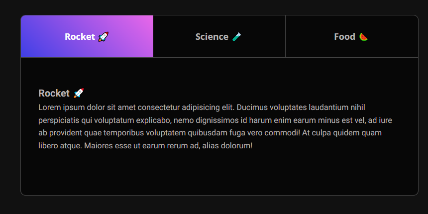
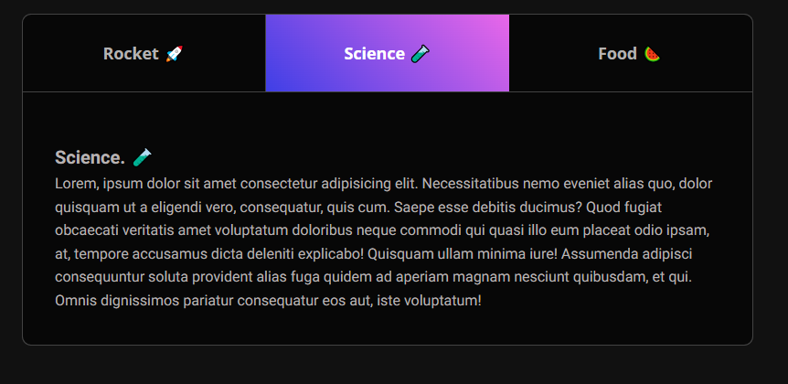
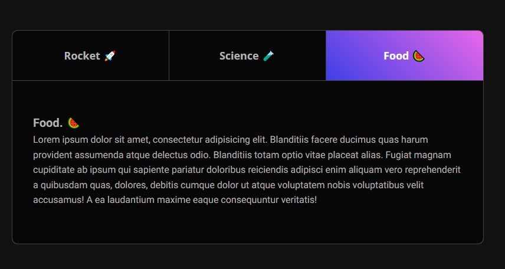

# Projet Onglets   refait avec le cours d'Enzo : Onglets

Ce projet implémente une interface d'onglets accessible et interactive en utilisant HTML, CSS et JavaScript.

## Technologies utilisées
    
 

## Table des matières

- [Aperçu](#aperçu)
- [Instructions d'installation](#instructions-dinstallation)
- [Technologies utilisées](#technologies-utilisées)
- [Structure du projet](#structure-du-projet)
- [Instructions d'installation](#instructions-dinstallation)
- [Code HTML](#code-html)
- [Code JavaScript](#code-javascript)

## Aperçu
# Projet Onglets

## Aperçu des images

Rocket:

Science:

Food:

Ce projet présente une interface utilisateur avec des onglets permettant de naviguer entre différentes sections de contenu. Les onglets peuvent être activés par clic ou par navigation au clavier, assurant ainsi une accessibilité optimale.

## Instructions d'installation
- Clonez ce dépôt sur votre machine locale.
- Ouvrez le fichier index.html dans votre navigateur web.

## Structure du projet

Le projet est structuré de la manière suivante :

- Interface à onglets interactive
- Navigation possible par clic ou au clavier
- Design responsive
- Accessibilité optimisée avec l'utilisation d'attributs ARIA

## Code HTML
Le fichier HTML définit la structure de base de l'interface à onglets. Chaque onglet est représenté par un bouton, et le contenu associé est placé dans des div séparées.

## Code JavaScript
Le JavaScript gère l'interactivité des onglets, y compris :
Le changement d'onglet actif lors du clic
La navigation au clavier entre les onglets
La mise à jour de l'affichage du contenu en fonction de l'onglet sélectionné

Pour plus de détails, consultez les commentaires dans le fichier [script](./Tabs/1.Starter/script.js).

